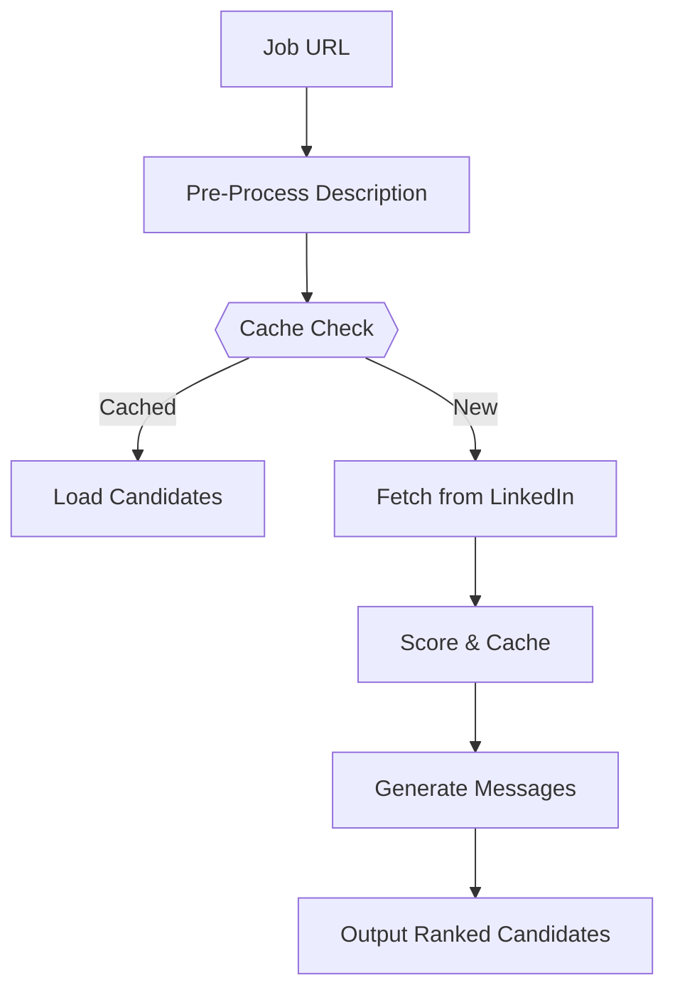
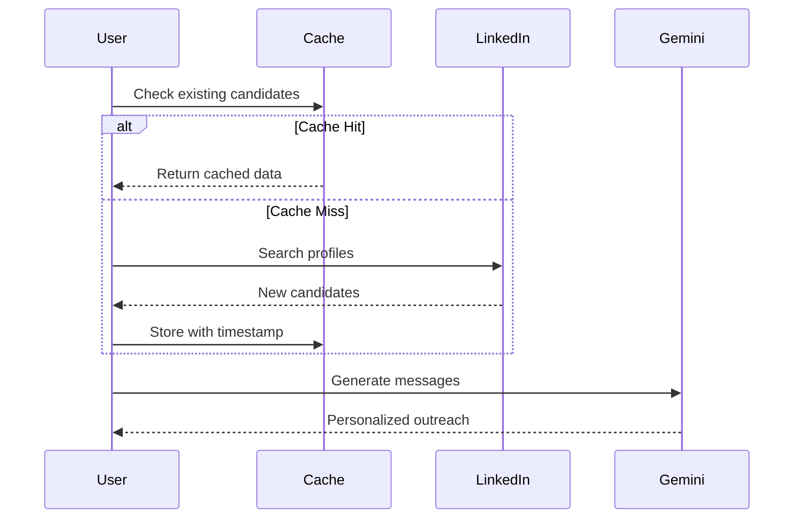

# Synapse Recruitment Automation


This work takes part of Synapse Annual First Ever AI Hackathon - Sourcing Agent Challenge.

It's an automated pipeline that:
1. 📝 Processes job descriptions
2. 🔍 Finds matching LinkedIn candidates, caches them to avoid refetching
3. 💯 Scores candidates intelligently
4. ✉️ Generates personalized outreach

### Advanced Cache Features
```python
# cache.pkl structure (automatically maintained)
{
    "linkedin_url": {
        "profile": {candidate_data},
        "timestamp": "2023-11-20T14:30:00"  # 7-day expiration
    }
}
```

## 🚀 Quick Start

# 1. Clone repo
```bash
git clone https://github.com/ismailghediri/synapse-ai-sourcing-agent.git
cd synapse-ai-sourcing-agent
```
# 2. Setup environment (auto-installs ChromeDriver)
```bash
python -m venv venv
source venv/bin/activate  # Linux/Mac
venv\Scripts\activate    # Windows
```

# 3. Install dependencies
```bash
pip install -r requirements.txt
```

# 4. Configure API keys
```bash
cp .env.example .env
```

 API Configuration
 
Edit .env with your keys(or contact me via ismail.ghediri55@gmail.com to provide you with the keys I'm using):

# .env
SERPER_API_KEY="your_serper_key_here"
GEMINI_API_KEY="your_gemini_key_here"

## 🛠️ Usage
Run directly:
```bash
python main.py
```
You can change job_url variable in main.py with the job description you want.

## ⚙️ How It Works
Pipeline Architecture



Data Flow


## 🔑Key Components
File	Purpose

job_input.py	Extracts job details using Selenium

search_linkedin.py	Finds candidates via Serper API

score_candidates.py	Rates candidates (0-10)

generate_outreach.py	Crafts messages with Gemini AI

## 📊 Scoring Metrics

35% Skills match

25% Experience level

20% Education

10% Location

10% Career trajectory

## 🚨 Troubleshooting
Cache-Specific Issues:
```bash
# Reset corrupted cache
echo "{}" > cache.pkl

# Permission issues
chmod 644 cache.pkl

# Debug cache hits
grep "Loading from cache" search_linkedin.py
```

Common Issues:
```bash
# If Selenium fails:
pip install --upgrade webdriver-manager selenium

# Missing Chrome (Linux):
sudo apt install -y chromium-browser

# API errors:
1. Check quota at https://ai.google.dev
2. Verify keys in .env
```